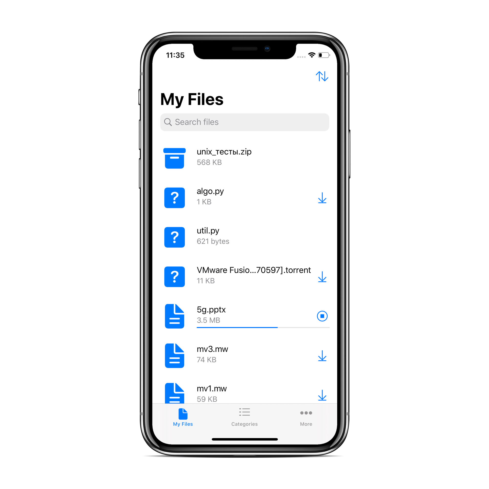
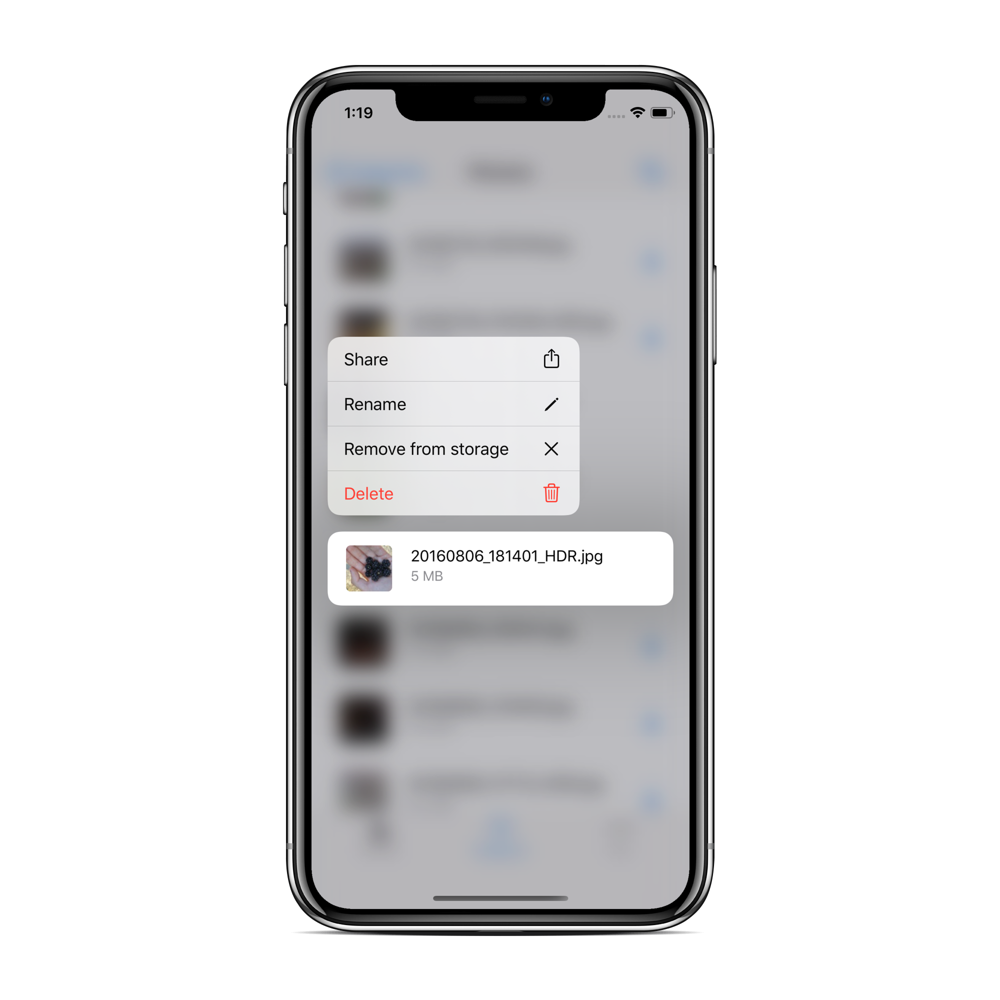
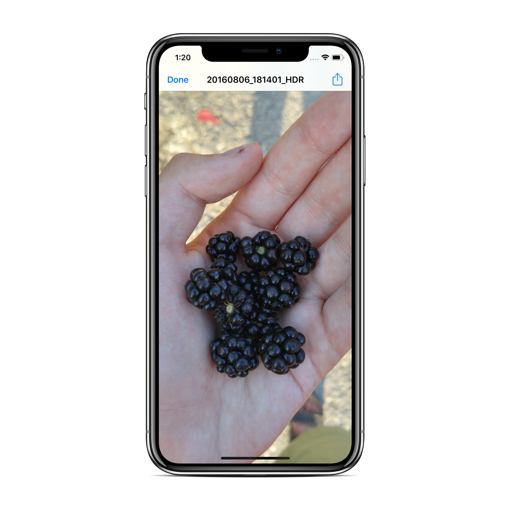
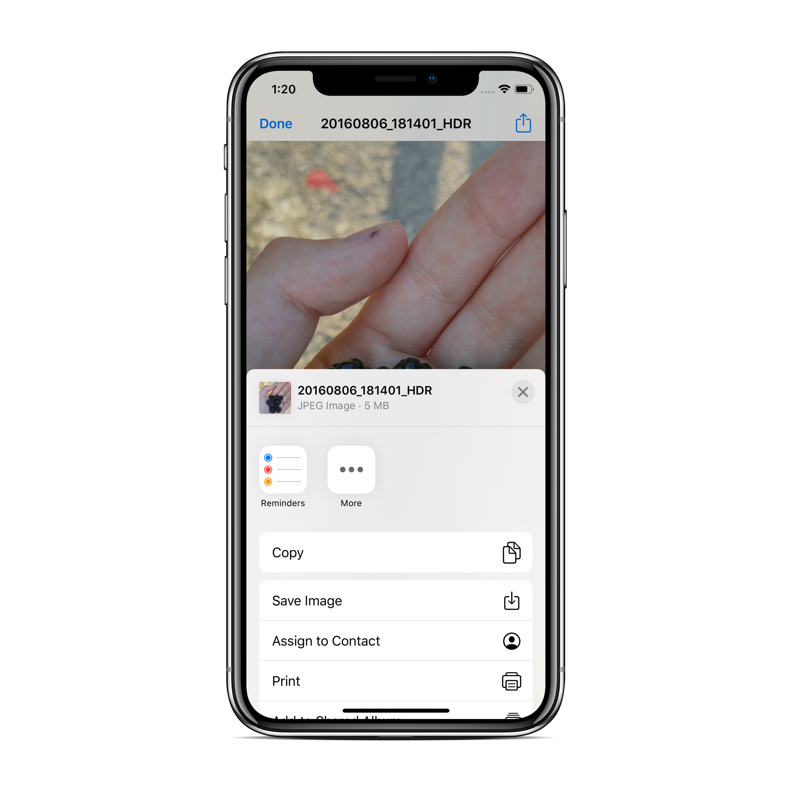

# vk-files
VK file manager

### Features:

* Возможность авторизоваться в ВК
* Отображение списка файлов пользователя
* Выполнение стандартных действий над файлами: удалить/переименовать
* Открытие документов через другие приложения
* Интеграция в системное приложение "Файлы"
* Открытие некоторых форматов файлов внутри приложения
* Сортировка списка файлов
* Поиск по файлам
* Фильтрация файлов по категориям
* Поддержка темной темы оформления ОС

### Инструкция для запуска:

1. Установите [Carthage](https://github.com/Carthage/Carthage#installing-carthage), если он не установлен
2. Выполните `carthage update` в папке проекта
3. Кажется, все... Можно наслаждаться

### Скриншоты:

 
 
